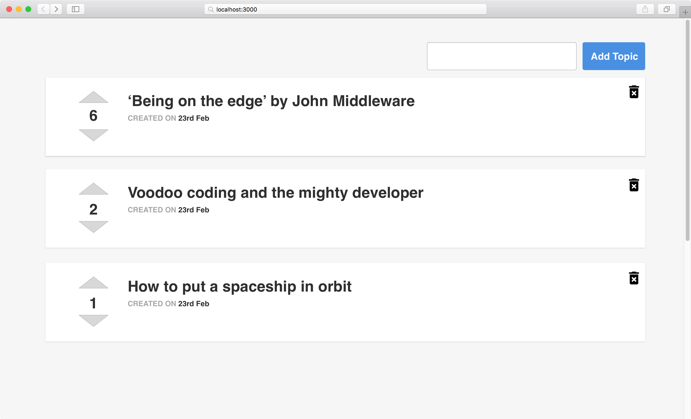

# Weekly Assessment 5 (4 hours)

## Codemocracy

In this exercise you have to demonstrate your proficiency as a full-stack developer. You should create a complete system that allow a user to list and post new topics, and to let the others vote them up and down.

Please, read all this document before beginning with the assessment.

**Note: To complete it you can search docs online, but not entire solutions.**

## Back-End

Please, create a backend in ExpressJS that implements the following [documentation](http://docs.codemocracy.apiary.io/). Place it in a folder called `server`.

We encourage you to use MongoDB + mongoose for the data layer, but you can use your preferred database and ORM.

## Front-End

Create a SPA with Angular2 in the `client` folder. Use Angular CLI for creating the app and every component, service, pipe or anything alse that you need.

Keep in mind that the API documentation given in the Back-End section, also provides a mock api url, so you can use it to create the front-end before you start working with the server if you want.

Here you have an exemple on how the app should look:

### Requirements:

- When the user enters the page, this should list all the topics.
  - This list should be sorted by score, descendent.
  - Show the created date formatted.
  - If no topic is listed, the page should show a message like 'No topics yet'
- When the user clicks 'Add Topic' it should create the new topic.
  - If the content of the text field is empty an error should be shown.
  - Once the topic is added to the server, it should be shown automatically at the bottom of the list.
- When the user clicks on the trash icon at the right of the topic, it should be deleted.
- When the user clicks the up/down arrow, the score of the topic should be updated.
  - At the end of this action the list of topics should be sorted with the new scores.

## Extra time? Extra credits

- Add a loader (spinner, etc…) for every api request.
- Make it responsive.
- Write tests for the back-end part

Ignition! 🚀